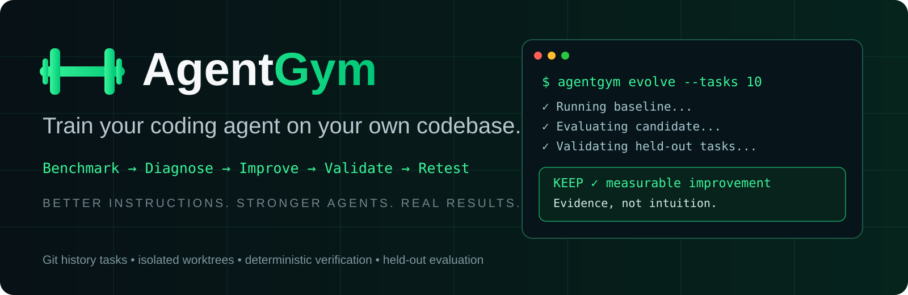

<p align="center">
  
</p>

# AgentGym

**Train your coding agent on your own codebase.**

AgentGym is an experimental local evaluation harness for coding agents. It turns repository history into replay tasks, runs an agent inside isolated Git worktrees, verifies results with deterministic project checks, and compares baseline behavior against candidate repository instructions.

> Benchmark → Diagnose → Improve → Validate → Retest.

## Status

`v0.3.0` is an early MVP focused on JavaScript/TypeScript repositories with package scripts and a Codex CLI adapter. The key change in v0.3 is **multi-task evaluation with held-out validation**: AgentGym no longer decides whether an instruction is useful from a single commit.

AgentGym intentionally separates two ideas:

- **readiness metadata** — static signals such as AGENTS.md, test scripts, lint and CI;
- **agent performance** — executable outcomes on replay tasks.

A readiness score is never presented as an agent benchmark score.

## Quick start

```bash
npm install
npm link
agentgym doctor
agentgym benchmark --tasks 10 --no-agent
agentgym evolve --tasks 10 --holdout 30 --no-agent
```

For a real coding-agent run, install and authenticate Codex CLI, then remove `--no-agent`:

```bash
agentgym benchmark --tasks 10
agentgym evolve --tasks 10 --holdout 30
```

Select a Codex model with:

```bash
agentgym evolve --tasks 10 --model <model>
```

## Multi-commit replay tasks

AgentGym samples non-merge commits from Git history. Each selected commit becomes a replay task:

1. Identify commit `C` and its single parent `P`.
2. Create a detached disposable Git worktree at `P`.
3. Run the repository verification commands before the agent.
4. Count the task only if the historical pre-fix state actually fails at least one check.
5. Ask the coding agent to diagnose and fix the regression.
6. Run the same verification commands after the agent.
7. Reject solutions that modify test files merely to make failures disappear.
8. Remove the worktree.

Tasks whose parent state is already green are reported as `SKIP` rather than becoming vacuous successes.

## Held-out evolution

`agentgym evolve` splits sampled tasks into **training** and **held-out** partitions.

```text
Git history
    │
    ├── training tasks
    │      ├── baseline
    │      └── candidate + generated AGENTS.md
    │
    └── held-out tasks
           ├── baseline
           └── candidate + generated AGENTS.md
```

The current candidate adds a concise `AGENTS.md` containing minimal-edit and verification guidance. AgentGym reports `KEEP` only when:

1. the candidate improves training performance;
2. it is not worse on either training metric;
3. it does not regress held-out evaluation when usable held-out tasks exist.

This is deliberately stricter than choosing the prompt that happens to win on the same task used to create it.

## Example output

```text
Task split: 7 training · 3 held-out

Training baseline
PASS a1b2c3d4  100/100  fix parser edge case
FAIL d4e5f6a7    0/100  fix stale cache
...
Usable: 6/7 · Pass rate: 50% · Verification: 58/100

Training candidate
...
Usable: 6/7 · Pass rate: 67% · Verification: 75/100

Held-out baseline
Usable: 3/3 · Pass rate: 67% · Verification: 67/100

Held-out candidate
Usable: 3/3 · Pass rate: 67% · Verification: 67/100

Training delta: +17 score, +17 pass-rate points
Held-out delta: +0 score, +0 pass-rate points
KEEP ✓ Candidate improved training and did not regress held-out evaluation.
```

The numbers above illustrate the output format; AgentGym only prints real results from the repository being evaluated.

## Commands

```text
agentgym doctor
agentgym benchmark [--tasks N] [--candidate] [--model MODEL] [--no-agent]
agentgym evolve [--tasks N] [--holdout PERCENT] [--model MODEL] [--no-agent]
agentgym init
```

`--tasks N` defaults to `10`. `--holdout PERCENT` defaults to `30` and is clamped to a conservative range by the current MVP.

## Deterministic verification

For Node repositories AgentGym detects these package scripts when present:

- `test`
- `typecheck` / `type-check`
- `lint`

The verification score is the percentage of available checks that pass. A task can only count as a successful repair if a regression was detected before the agent and every detected verification command passes afterward.

## Safety model

Agent runs are launched with Codex's workspace-write sandbox and no approval prompts, inside disposable detached Git worktrees. The original repository is not modified by benchmark/evolution runs.

Repository verification commands can themselves execute arbitrary project code. Only benchmark repositories you trust.

## Agent Skill

The repository includes:

```text
skills/agentgym/
├── SKILL.md
└── references/
    └── evaluation.md
```

Install the skill bundle into another repository with:

```bash
agentgym init
```

## What v0.3 proves

The test suite covers:

- source/worktree isolation;
- historical replay task construction;
- non-vacuous regression detection;
- a ground-truth historical patch successfully solving a replay task;
- deterministic training/held-out partitioning;
- suite scoring and token aggregation;
- rejection when training improves but held-out performance regresses.

Run it with:

```bash
npm test
```

## Roadmap

The next milestones are stronger task qualification, filtering likely bug-fix commits, dependency-install strategies for historical worktrees, multiple candidate mutations (`AGENTS.md`, skills and hooks), cost-aware selection, repeated trials for stochastic agents, additional agent adapters, JSON/HTML reports, and a GitHub Action.

## Why AgentGym

Most tools answer:

**“How good is my coding agent?”**

AgentGym aims to answer:

**“Which repository instructions measurably make my coding agent better — including on tasks it did not train on?”**

## License

MIT
