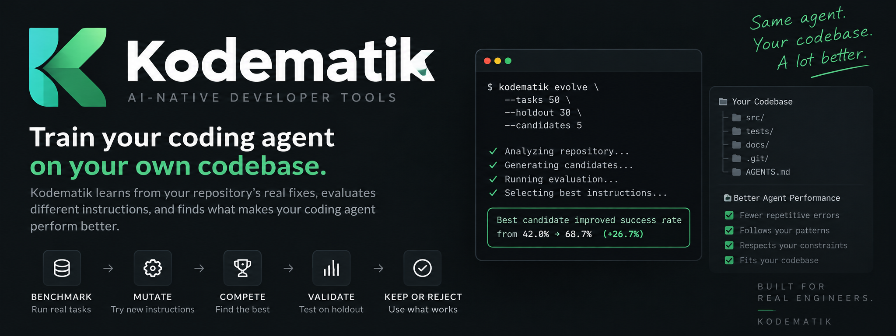

<p align="center"></p>
<h1 align="center">Kodematik</h1>
<p align="center"><strong>Train your coding agent on your own codebase.</strong></p>
<p align="center"><em>Benchmark → Mutate → Compete → Validate → Keep or Reject.</em></p>
<p align="center">
  <a href="https://github.com/puspoaditya/kodematik/actions/workflows/ci.yml"></a>
  
  
  
  
</p>
<p align="center">
  
  
  
  
  
  
  
  
</p>

**Kodematik** is a local evaluation and evolution harness for coding agents. It turns repository history into executable replay tasks, benchmarks agent behavior in isolated Git worktrees, generates competing repository-instruction strategies, selects a winner on training tasks, and validates that winner on held-out tasks.

Kodematik does **not** fine-tune the foundation model. It searches for repository instructions that measurably improve how a coding agent works inside a particular codebase.

> Repository history becomes the training ground. Deterministic checks become the judge. Held-out tasks decide whether an instruction strategy deserves to stay.

## ✨ Why developers use Kodematik

| | |
| --- | --- |
| 🧬 **Repository-native** | Learns from real fixes already present in Git history |
| 🧪 **Executable evaluation** | Uses actual repository checks instead of subjective readiness scores |
| 🏟️ **Mutation tournament** | Competes multiple instruction strategies against the same training tasks |
| 🔒 **Held-out validation** | A winner must generalize before Kodematik recommends keeping it |
| 🌳 **Isolated by design** | Agent experiments run in disposable Git worktrees |
| 🧠 **Model-independent idea** | Optimizes the repository around the agent rather than fine-tuning the model |

## 🧰 Tech stack

| Layer | Technology | Role |
| --- | --- | --- |
| Runtime | **Node.js 20+** | Fast, portable CLI runtime |
| Language | **JavaScript ESM** | Zero-build command-line implementation |
| Repository engine | **Git + worktrees** | Historical replay and isolated experiments |
| Coding agent | **Codex CLI** | Current real-agent adapter |
| Evaluation | **Repository test / typecheck / lint scripts** | Deterministic ground truth |
| Agent context | **AGENTS.md + Agent Skills** | Instruction mutation surface |
| CI | **GitHub Actions** | Node 20/22 syntax, unit, and smoke tests |

## v0.4 — Actual Evolution

`kodematik evolve` runs a mutation tournament instead of trusting one hand-written candidate.

```text
Historical repository tasks
          │
     Train / Held-out
          │
          ├──────── Training ──────────────────────┐
          │                                        │
       Baseline                            Mutation candidates
                                             ├─ minimal
                                             ├─ test-first
                                             ├─ repo-map
                                             ├─ verify-strict
                                             └─ combined
                                                   │
                                             Tournament
                                                   │
                                                Winner
                                                   │
          └──────── Held-out ──────────────────────┤
                                                   │
                                          Baseline vs Winner
                                                   │
                                             KEEP / REJECT
```

The built-in strategies emphasize minimal patches, test-first diagnosis, repository-aware changes, strict verification, and a combined strategy. Existing historical `AGENTS.md` content is preserved and augmented only inside disposable evaluation worktrees.

Tournament ranking is deterministic: **pass rate → verification score → lower token usage → candidate id**. Only the training winner reaches held-out evaluation, which reduces evaluation cost and avoids using holdout results to select a candidate.

## 🚀 Quick start

```bash
git clone https://github.com/puspoaditya/kodematik.git
cd kodematik
npm install
npm link

kodematik doctor
kodematik benchmark --tasks 10 --no-agent
kodematik evolve --tasks 10 --holdout 30 --candidates 5 --no-agent
```

For real agent runs, install and authenticate Codex CLI, then remove `--no-agent`:

```bash
kodematik evolve --tasks 20 --holdout 30 --candidates 5
```

Select a model with `--model <model>`.

## 📏 What gets measured

A replay task counts only when the historical parent state actually fails at least one available deterministic verification command. Kodematik then gives the coding agent a regression-fixing task and reruns the same checks.

A repair cannot pass by merely weakening tests: edits to test/spec files are rejected by the current harness. Available Node verification currently includes `test`, `typecheck` / `type-check`, and `lint` package scripts.

## 🏆 Example tournament

```text
Task split: 14 training · 6 held-out
Evolution tournament: 5 mutation candidates

Training tournament
candidate              pass rate  verify  tokens
baseline                    58%        64     18420
minimal                     67%        71     17790
test-first                  72%        78     19120
repo-map                    76%        82     18840
verify-strict               69%        80     19600
combined                    81%        87     20110  ← winner

Validating only the winner on held-out tasks...
Held-out baseline: 61%
Held-out winner:   78%

KEEP ✓ Combined strategy won training and did not regress held-out evaluation.
```

**These numbers are illustrative, not benchmark claims.** Kodematik should publish performance numbers only when they come from reproducible real-agent runs.

## ⌨️ Commands

| Command | Purpose |
| --- | --- |
| `kodematik doctor` | Inspect repository readiness metadata |
| `kodematik benchmark --tasks N` | Replay historical tasks and measure the agent |
| `kodematik evolve --tasks N --holdout P --candidates N` | Run mutation tournament + held-out validation |
| `kodematik init` | Install the Kodematik skill bundle |

Defaults: `--tasks 10`, `--holdout 30`, `--candidates 5`.

## 🛡️ Safety and evaluation integrity

Agent runs use Codex's workspace-write sandbox inside disposable detached Git worktrees. Benchmark/evolution runs do not intentionally modify the source repository. Project verification scripts execute repository code, so evaluate only repositories you trust.

Kodematik separates **readiness metadata** from **agent performance**. Static signals such as `AGENTS.md` or a CI workflow are useful diagnostics, but they are not evidence that an agent performs better.

## 🤖 Agent Skill

The repository includes `skills/kodematik/SKILL.md` and `skills/kodematik/references/evaluation.md`. Install the bundle into another repository with:

```bash
kodematik init
```

The skill follows the same train/held-out discipline as the CLI and documents the v0.4 tournament behavior, including `--candidates N` and winner-only held-out validation.

## ✅ Continuous integration

Every push and pull request to `main` runs syntax checks, unit tests, and a CLI smoke test on **Node.js 20 and 22**. The CI badge reflects the live GitHub Actions state.

```bash
npm run check
npm test
```

## 🗺️ Roadmap

- [x] Multi-task historical replay
- [x] Train / held-out evaluation
- [x] Multiple competing instruction mutations
- [x] Deterministic training tournament
- [x] Winner-only held-out validation
- [x] GitHub Actions CI on Node.js 20 and 22
- [x] Kodematik package and CLI rebrand
- [x] Kodematik v0.4 skill bundle
- [x] Rename GitHub repository to `kodematik`
- [x] Kodematik hero banner
- [ ] Stronger bug-fix task qualification
- [ ] Historical dependency-install strategies
- [ ] Generated repo-specific mutations
- [ ] Repeated stochastic trials and confidence intervals
- [ ] Additional coding-agent adapters
- [ ] JSON / HTML reports
- [ ] npm package and release automation
- [ ] Real-world reproducible benchmark results

## 💡 Why Kodematik?

Most evaluation tools answer **“How good is my coding agent?”**

Kodematik is built to answer a different question:

> **“Which repository instructions measurably make my coding agent better — including on tasks they were not selected on?”**

That makes `evolve` the core loop: **benchmark → mutate → compete → validate → keep or reject**.

## 🤝 Contributing

Reproducible failure cases, new mutation strategies, coding-agent adapters, and evaluation ideas are welcome.

## 📄 License

MIT © Kodematik contributors
